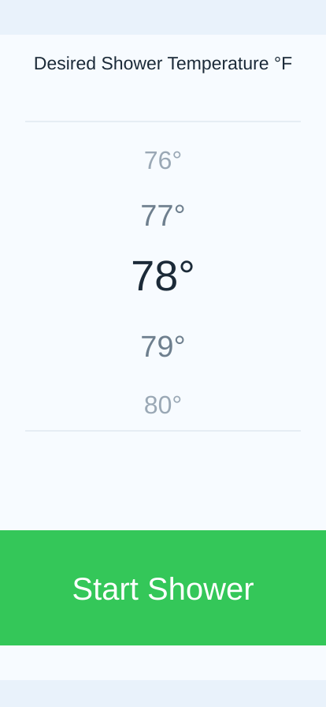

# Smart Shower Mobile App

Smart Shower is a college Wireless Sensor Networks project that ties together an iOS app, an AWS IoT message bridge, a Raspberry Pi shower controller, and a small habit-recognition module. The system is designed to let a user choose a target shower temperature from a phone, send that request through AWS IoT, adjust a physical shower valve with a servo and PID loop, and notify the app when the shower is ready.

The repository is also now set up as a unit-tested school/practice repo. The testable code is the Python habit-recognition logic in `machineLearning/binning_kbins.py`; CI runs those unit tests on pushes and pull requests for both `main` and `dev`.

## Repository Layout

```text
.
├── .github/
│   ├── dependabot.yml
│   └── workflows/ci.yml
├── docs/
│   └── ui-preview.svg
├── machineLearning/
│   ├── binning_kbins.py
│   ├── shower_ec2_pubsub.py
│   ├── temperatures.txt
│   ├── test_binning_kbinsdis.py
│   └── time_data.txt
├── showerController/
│   ├── controller-demo1.py
│   ├── controller-demo2.py
│   ├── controller-demo3.py
│   └── stop-shower.py
├── smartShowerApp/
│   ├── Podfile
│   ├── Podfile.lock
│   └── smartShowerApp/
├── tests/
│   └── test_binning_kbins.py
├── pyproject.toml
└── requirements-dev.txt
```

## System Components

### iOS App

The iOS app is in `smartShowerApp/`. It is a UIKit app built with Xcode, Swift, CocoaPods, and the AWS iOS SDK. Its main screen lets the user pick a desired temperature from a `UIPickerView` and press a start/stop button. The app publishes shower commands to AWS IoT and subscribes to status and notification topics.

The app persists the selected temperature and shower-on state with Core Data so it can restore the correct UI after relaunch. It also includes foreground alert flows for "Shower Ready" and "Shower Suggestion" messages.



### AWS IoT / EC2 Message Bridge

`machineLearning/shower_ec2_pubsub.py` is the EC2-side pub/sub bridge. It subscribes to the mobile app and controller topics, relays start/stop/temperature commands, forwards shower-ready status back to the app, and stores shower time/temperature history.

The script expects AWS IoT settings through environment variables:

```bash
export SMART_SHOWER_AWS_IOT_HOST="your-ats-endpoint.amazonaws.com"
export SMART_SHOWER_AWS_ROOT_CA_PATH="/path/to/root-ca.pem"
export SMART_SHOWER_AWS_CERTIFICATE_PATH="/path/to/device-certificate.pem.crt"
export SMART_SHOWER_AWS_PRIVATE_KEY_PATH="/path/to/private.pem.key"
```

### Habit Recognition

`machineLearning/binning_kbins.py` reads historical shower temperatures and start times from:

- `machineLearning/temperatures.txt`
- `machineLearning/time_data.txt`

It calculates the most common shower temperature with `statistics.mode`, bins shower start times with scikit-learn `KBinsDiscretizer`, and returns a suggested `(time, temperature)` tuple for the notification flow.

The original production file was named `test_binning_kbinsdis.py`, which made pytest treat application code like a test module. That file now remains as a compatibility wrapper, while the real implementation lives in `machineLearning/binning_kbins.py`.

### Raspberry Pi Shower Controller

`showerController/controller-demo3.py` is the latest controller demo. It connects to AWS IoT, listens for shower control messages, reads a DS18B20 temperature sensor, and uses a PID controller plus an Adafruit Servo HAT to move the shower valve toward the requested temperature. It publishes a ready status when the measured temperature is within roughly +/-0.5 degrees Fahrenheit of the target.

## Prerequisites

### Python

- Python 3.12 recommended for local testing and CI parity
- pip

Install test dependencies:

```bash
python -m pip install -r requirements-dev.txt
```

### iOS

- macOS with Xcode
- CocoaPods
- An AWS IoT/Cognito configuration file such as the ignored `smartShowerApp/smartShowerApp/Constants.swift`

Install CocoaPods if needed:

```bash
sudo gem install cocoapods
```

Install iOS dependencies:

```bash
cd smartShowerApp
pod install --repo-update
```

### Controller Hardware

- Raspberry Pi 3B+ or compatible Pi
- Adafruit 16-channel Servo HAT
- Waterproof DS18B20 temperature sensor
- Servo motor suitable for the valve fixture
- AWS IoT certificate/key files
- Python packages used by the controller: `AWSIoTPythonSDK`, `adafruit_servokit`, and `simple_pid`

## Build And Launch Commands

### Run Unit Tests

```bash
python -m pytest
```

The pytest configuration in `pyproject.toml` runs tests from `tests/`, measures coverage for `machineLearning.binning_kbins`, and fails if line coverage drops below 90%.

### Run Quality Checks

```bash
python -m ruff check machineLearning tests
```

### Launch The EC2 Pub/Sub Bridge

Set the AWS environment variables listed above, then run:

```bash
python -m machineLearning.shower_ec2_pubsub
```

### Launch The Raspberry Pi Controller

Run this on the Raspberry Pi with the sensor, servo, AWS credentials, and hardware libraries installed:

```bash
cd showerController
python3 controller-demo3.py
```

### Build And Run The iOS App

Open the workspace, not the `.xcodeproj`, because CocoaPods dependencies are wired through the workspace:

```bash
cd smartShowerApp
xed smartShowerApp.xcworkspace
```

Then select an iOS simulator or device in Xcode and press Run.

## Unit Tests

Tests live in `tests/test_binning_kbins.py`. They cover:

- parsing newline-delimited sensor/history files
- handling missing data files
- converting nested string values to floats
- grouping shower times into K-means bins
- choosing the most stable shower-time bin
- returning no suggestion when data is insufficient or too noisy
- calculating the `(suggested_time, suggested_temperature)` result

Current local verification:

```text
python -m pytest
11 passed
Line coverage: 94.38%

python -m ruff check machineLearning tests
All checks passed
```

## GitHub Actions Pipeline

The workflow is defined in `.github/workflows/ci.yml` and runs on:

- pushes to `main`
- pushes to `dev`
- pull requests targeting `main`
- pull requests targeting `dev`

The workflow uses least-privilege top-level permissions, per-job permissions where needed, Python dependency caching, and concurrency cancellation so outdated runs do not pile up.

### Unit Tests

The `Unit Tests` job:

- checks out the repository
- sets up Python 3.12
- installs `requirements-dev.txt`
- runs `python -m pytest`
- enforces the 90% coverage gate configured in `pyproject.toml`

### Code Scanning: Quality

The `Code Scanning / Quality` job:

- sets up Python 3.12
- installs Ruff
- runs `ruff check machineLearning tests`

Ruff provides fast static checks for Python quality issues such as unused imports, undefined names, and common style problems.

### Code Scanning: Security

The `Code Scanning / Security` job runs GitHub CodeQL for Python with the `security-and-quality` query suite. CodeQL results appear in GitHub's code scanning alerts when the repository type supports code scanning.

GitHub's current documentation says CodeQL code scanning is available for public repositories on GitHub.com and for organization-owned repositories with GitHub Code Security enabled.

### Code Scanning: Security / Dependency Review

The `Code Scanning / Security / Dependency Review` job runs only on pull requests. It uses GitHub's dependency review action to detect vulnerable dependency changes before they merge.

GitHub's current documentation says dependency review is available for public repositories and for organization-owned repositories with GitHub Code Security enabled.

### Dependency Automation

`.github/dependabot.yml` enables weekly Dependabot version checks for:

- GitHub Actions used by workflow files
- Python dependencies declared at the repository root

GitHub's current documentation says Dependabot version updates are available for all repositories on GitHub.

### Repository Settings Worth Enabling

Some free GitHub security features are controlled in repository settings rather than workflow files:

- Enable Dependabot alerts and Dependabot security updates.
- Enable the dependency graph if it is not already enabled.
- Enable secret scanning and push protection where available. GitHub currently runs secret scanning automatically for public repositories, while some private/internal repository options depend on plan and ownership.

## Notable Code Improvements

- Moved habit-recognition logic from a pytest-looking production filename into `machineLearning/binning_kbins.py`.
- Kept `machineLearning/test_binning_kbinsdis.py` as a compatibility wrapper for older imports.
- Added real unit tests and a 90% coverage gate.
- Fixed K-means bin label handling so bin `0.0` values are not discarded.
- Updated the EC2 bridge to read AWS IoT settings from environment variables and fail with a clear startup error when they are missing.
- Converted temperature history writes to strings so numeric MQTT payloads do not crash file logging.

## Original References

- [AWS IoT Python SDK](https://github.com/aws/aws-iot-device-sdk-python)
- [AWS SDK for iOS](https://github.com/aws-amplify/aws-sdk-ios)
- [AWS IoT iOS guide](https://medium.com/swlh/connect-an-ios-app-to-aws-iot-fc99d5a9562f)
- [CocoaPods](https://cocoapods.org)
- [Adafruit Servo HAT guide](https://learn.adafruit.com/adafruit-16-channel-pwm-servo-hat-for-raspberry-pi)
- [Adafruit DS18B20 temperature sensing guide](https://learn.adafruit.com/adafruits-raspberry-pi-lesson-11-ds18b20-temperature-sensing)
